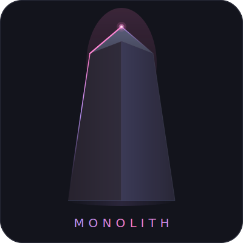
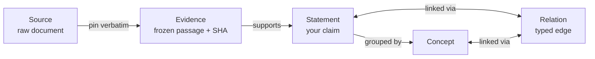
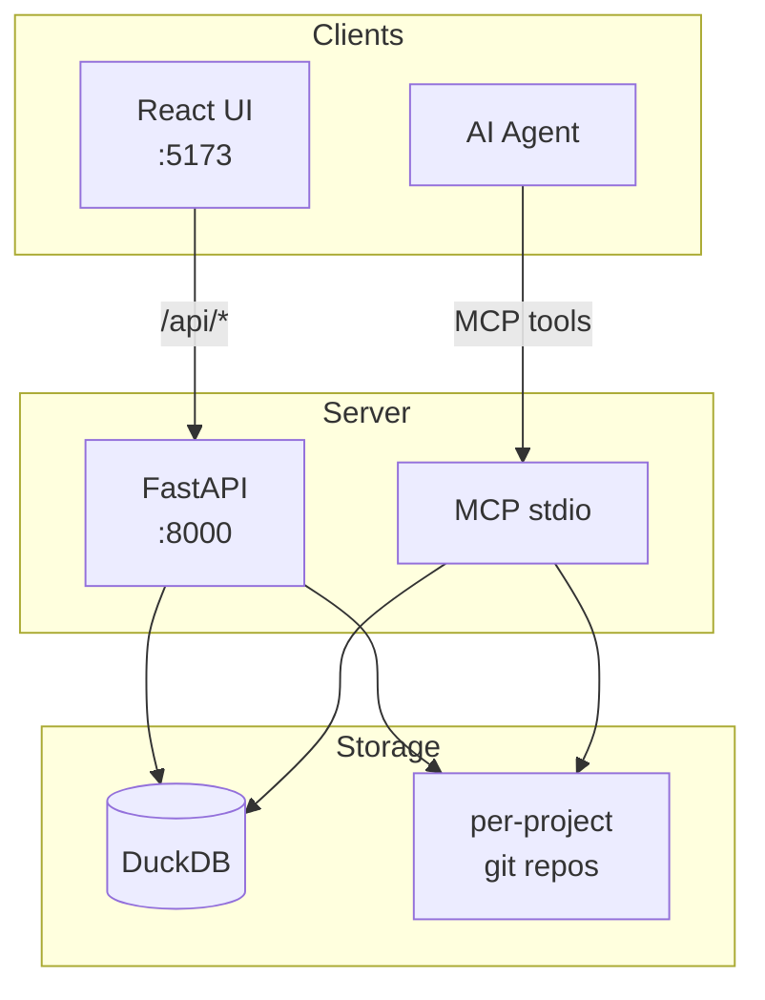

  

  
  

> "Remember — it all depends on who uses it, how they use it, and to what purpose."
> — Yennefer of Vengerberg, *Blood of Elves*

Monolith is a personal knowledge system for you and you AI agent built around a single idea: **every claim you make should trace back to something real**.

Not a summary. Not a paraphrase. A verbatim passage, in the original source, that you or an AI agent physically marked and said *this is why I believe that*.

---

## The problem with most knowledge tools

Most note-taking systems are great at capturing thoughts. They're bad at remembering *why* you had them.

You write a claim. You link it to a paper. Six months later the paper gets updated, your notes drift, and the connection between what you believe and what the evidence actually says quietly breaks. Nobody notices.

Monolith is designed so that can't happen silently.

---

## Standing on shoulders of giants

Scholars have always known that a claim without a source is just an opinion. Theologians copied scripture word for word in the margins of their arguments. Scientists footnoted obsessively. Niklas Luhmann built his Zettelkasten out of index cards, each one a single atomic idea linked by hand to every related card in the box. The physical act of marking a passage, copying it out, and connecting it to your own thinking was not busywork. It was the thinking.

Monolith is that practice, rebuilt for the modern AI age.

Monoliths are carved from obsidian, at least this one is. You will recognize the influence of tools like obsidian. Monolith reuses many concepts and even file formats from the tools that came before it, but it adds a layer of structure and accountability on top. It is not just a note-taking app, it is a knowledge management system that enforces the connection between claims and evidence.

---

## How it works

There are five things in Monolith:

**Sources** are the raw documents: papers, articles, books, personal notes. Monolith never modifies them and also forces your AI agent to preserve them. They stay exactly as you found them.

**Evidence** is a verbatim passage you have pinned inside a source. Not an AI summary of what it says but the actual words, frozen at the moment you marked them. When the source changes, Monolith notices and tells you exactly what broke and why.

**Statements** are the claims you actually believe. Each one is synthesized from one or more pieces of evidence. A statement without evidence does not exist in Monolith, or at least it cannot pretend to be grounded when it isn't.

**Concepts** are the ideas you use to group statements together. They are not claims in themselves, but they help you organize your thinking and see connections across different sources.

**Relations with properties** are the links between concepts, statements, and evidence. In contrast to tools like obsidian, these are not just links, they are specific entities inside the knowledge graph that can have their own metadata and annotations. For example, you can have a "supports" relation between a piece of evidence and a statement, and that relation can have properties like "confidence level" or "date added". Relations are manifested as note files in the file system, just like statements, making them compatible with tools that do not natively support typed edges, again like obsidian.

The core flow is always: *source, then evidence, then statement*, add concepts and relations as needed to organize and connect further. Be honest, everything else is just a distraction and a way for you to procrastinate in technical miscellanea instead of doing the hard work of reading and thinking.

### What about code?
Thinking on how your code fits into this? Great! But the code itself is not a statement. It is a source. Monolith leverages graphify's idea to parse code into an AST and treat each node as a potential piece of evidence. You can pin a function definition, a comment, or even a specific line of code as evidence to support a statement about how the code works. 

Whats great about this is that when the code changes, Monolith can show you exactly what changed and whether your evidence was affected. If a function you pinned as evidence gets refactored, you can see the diff and decide if your statement still holds or needs to be updated.

And even better: artifacts generated from code, like documentation or diagrams are just edidence, nothing more, nothing less. They can support statements, but they don't get to pretend to be the source of truth. The code which creates them is the source, always.

### The Knowledge Graph
All of these things are nodes in a single global knowledge graph. When you pin a passage, it becomes a piece of evidence connected to the source. When you write a statement, it becomes a node connected to the evidence that supports it. Concepts and relations weave through the graph, connecting everything together.
The graph view allows you to explore this graph visually. Different highlighting and filtering options let you see the structure of your knowledge, find gaps, and discover unexpected connections.

### Projects
Monolith is designed for people who work across multiple contexts: a research vault, multiple codebases, a reading list. Each project keeps its own notes. But all of it feeds into a single monolithic knowledge graph, monolith. 

When two projects touch semantically similar concepts, Monolith does not force them to be the same thing. Instead it lets you explicitly group them under a shared idea, with a note about how each treatment differs. You keep the nuance without losing the connection.

### The Annotation Layer

One of Monolith's core commitments is that your source files stay pristine. You can annotate sources to form evidence, but all the programmatic magic lives in a separate store and are overlaid when you view a document, the same way a translator's notes don't get printed inside the original manuscript.

This means you can open any source in any markdown editor and see exactly what the author wrote, no clutter added. The source layer is always clearly separate from the evidence layer.

### MCP Support
Monolith is designed to be used by an AI agent as well as a human. The MCP (Monolith Communication Protocol 😋) provides a standardized way for AI agents to interact with monolith, enforcing it to think in terms of evidence. Hallucinations are not impossible, but are constrained to interpretation. Also, monolith holds the agent accountable for its actions by adding author properties to nodes added by the agent.

### Underneath the Monolith

There are a few key and old-school concepts that allow Monolith to do what it does:

**Hashing**: All evidence is hashed. When the source changes, Monolith can detect exactly which pieces of evidence were affected by comparing the new hash with the old one. This is how it knows when your beliefs are at risk of drifting away from the evidence.

**Dependency Graphs**: Every node can have upstream dependencies, discoverable by design. Monolith traces the entire chain of dependencies from a statement back to the original sources. When something changes, it can show you the entire path of what is affected.

**Centrality**: The graph view uses centrality measures to highlight the most influential pieces of evidence and statements. This helps you see which sources are the most foundational to your knowledge.

**A rigid data model**: Everything in Monolith is a specific type of node with defined properties and relationships. This structure allows for powerful querying and analysis of your knowledge graph, but it also means you have to be disciplined about how you create and connect nodes. Best way to enforce it, is to either let the AI agent do it for you, or use monoliths frontend, which simply won't let you mess it up. Did you ever think about why sourcerors use spells? Because they want to make it impossible for them to channel their magic into something that isn't the spell. Monolith is the spell for knowledge.

### What Monolith is not

It is not a replacement for thinking. The agent can find and mark evidence, but only you can decide what it means.

It is not a database of facts. It is a record of your interpretation of sources, with the receipts attached.

It is not trying to be Notion, Roam, or Obsidian. Those tools help you think. Monolith helps you know what you actually know.

### The philosophy in one sentence

A belief you cannot trace to evidence is not knowledge. It is a guess with good formatting.

Monolith is the tool for people who want to know the difference.

---

### System Architecture

---

*Open source. Built on [Graphify](https://github.com/safishamsi/graphify). Inspired by Karpathy's wiki, obsidian and the long tradition of scholars who underlined things.*
